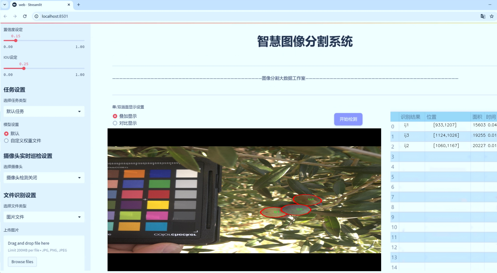
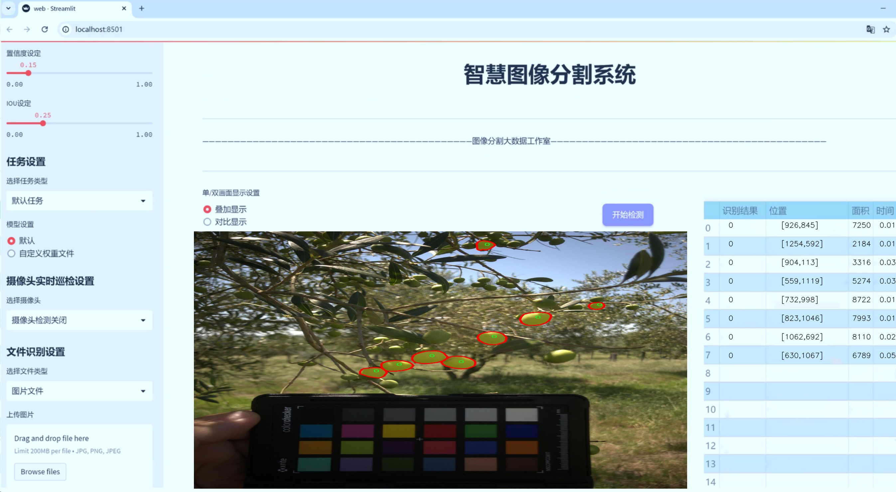
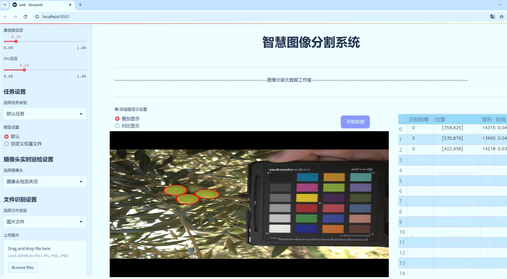
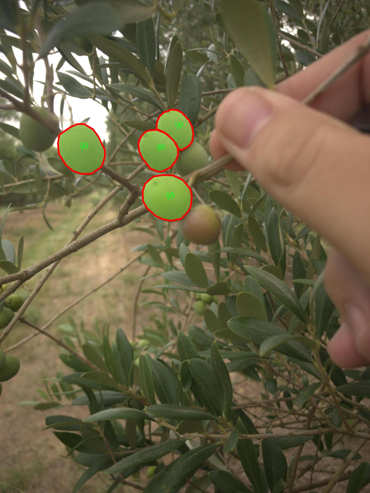
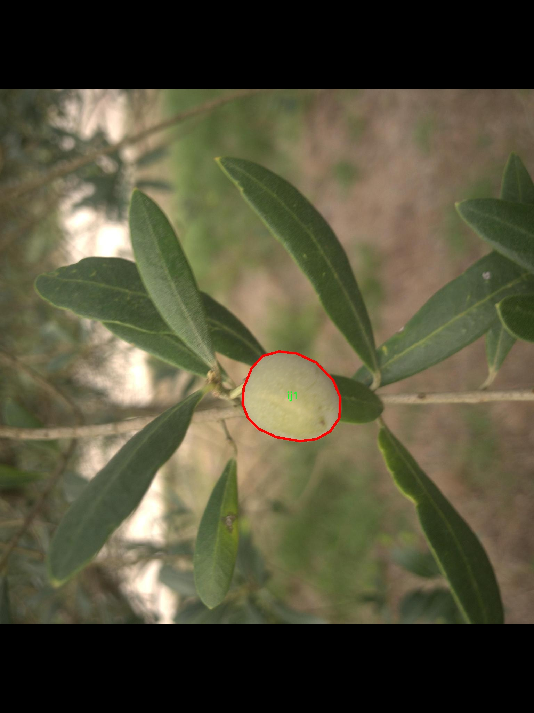
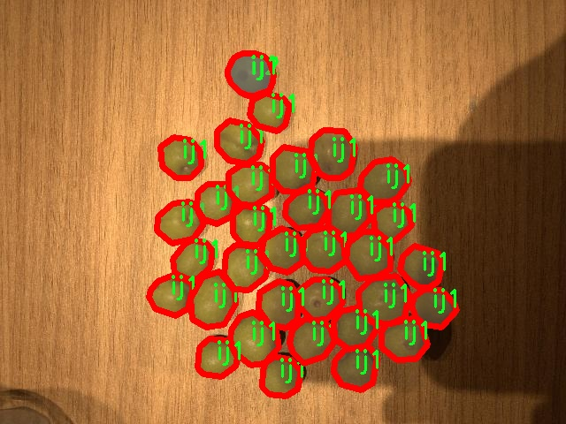
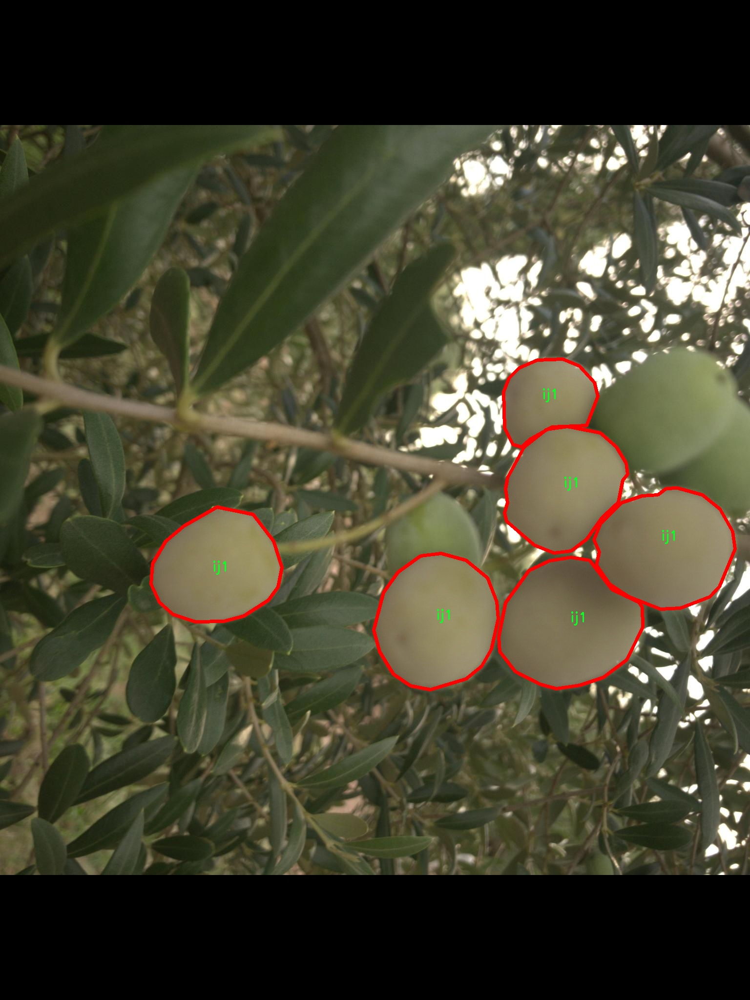
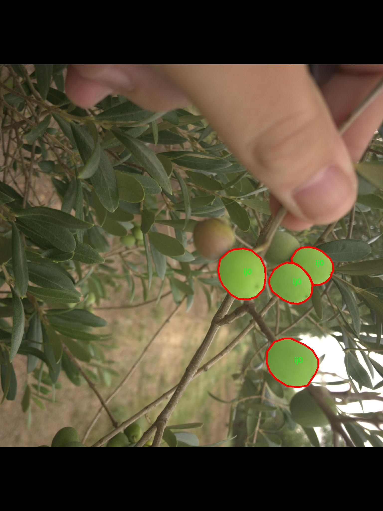

# 枣子图像分割系统源码＆数据集分享
 [yolov8-seg-RepHGNetV2＆yolov8-seg-AFPN-P345等50+全套改进创新点发刊_一键训练教程_Web前端展示]

### 1.研究背景与意义

项目参考[ILSVRC ImageNet Large Scale Visual Recognition Challenge](https://gitee.com/YOLOv8_YOLOv11_Segmentation_Studio/projects)

项目来源[AAAI Global Al lnnovation Contest](https://kdocs.cn/l/cszuIiCKVNis)

研究背景与意义

随着计算机视觉技术的迅速发展，图像分割作为其中的重要研究方向，已在多个领域展现出其广泛的应用潜力。尤其是在农业领域，图像分割技术能够有效提升作物监测、病虫害检测以及产量预测等方面的效率和准确性。近年来，枣子作为一种重要的经济作物，其种植面积和产量逐年增加，然而，传统的人工识别和分类方法不仅耗时耗力，而且容易受到主观因素的影响，导致识别结果的不准确。因此，基于深度学习的图像分割技术在枣子图像处理中的应用显得尤为重要。

YOLO（You Only Look Once）系列模型因其高效的实时检测能力而受到广泛关注。YOLOv8作为该系列的最新版本，结合了更为先进的网络结构和优化算法，具备了更强的特征提取能力和更快的处理速度。然而，尽管YOLOv8在目标检测方面表现优异，但在细粒度的图像分割任务中仍存在一定的局限性。因此，基于改进YOLOv8的枣子图像分割系统的研究，旨在通过对YOLOv8模型的优化，提升其在枣子图像分割任务中的表现。

本研究所使用的数据集包含2500张图像，涵盖了8个类别，包括ij0至ij5和olive等不同的标注类。这些数据的多样性和丰富性为模型的训练提供了良好的基础。通过对这些图像进行实例分割，可以有效地识别和分离出枣子及其周围环境中的其他物体，从而为后续的分析和处理提供准确的数据支持。特别是在枣子的生长和成熟过程中，能够及时、准确地获取枣子的生长状态和数量信息，将为农民的决策提供科学依据。

此外，改进YOLOv8的枣子图像分割系统不仅能够提升枣子的识别和分割精度，还能够为农业智能化发展提供技术支持。随着智能农业的兴起，利用先进的图像处理技术进行作物监测已成为一种趋势。通过构建高效的图像分割系统，能够为农业生产提供实时的监测和反馈，帮助农民及时发现问题并采取相应措施，从而提高作物的产量和质量。

综上所述，基于改进YOLOv8的枣子图像分割系统的研究，不仅具有重要的理论意义，也具有广泛的应用前景。通过对图像分割技术的深入研究，可以为农业生产提供更为高效、准确的技术手段，推动农业现代化的发展。未来，随着技术的不断进步和数据集的不断丰富，该系统有望在更广泛的农业领域中发挥重要作用，为实现可持续农业发展贡献力量。

### 2.图片演示







##### 注意：由于此博客编辑较早，上面“2.图片演示”和“3.视频演示”展示的系统图片或者视频可能为老版本，新版本在老版本的基础上升级如下：（实际效果以升级的新版本为准）

  （1）适配了YOLOV8的“目标检测”模型和“实例分割”模型，通过加载相应的权重（.pt）文件即可自适应加载模型。

  （2）支持“图片识别”、“视频识别”、“摄像头实时识别”三种识别模式。

  （3）支持“图片识别”、“视频识别”、“摄像头实时识别”三种识别结果保存导出，解决手动导出（容易卡顿出现爆内存）存在的问题，识别完自动保存结果并导出到tempDir中。

  （4）支持Web前端系统中的标题、背景图等自定义修改，后面提供修改教程。

  另外本项目提供训练的数据集和训练教程,暂不提供权重文件（best.pt）,需要您按照教程进行训练后实现图片演示和Web前端界面演示的效果。

### 3.视频演示

[3.1 视频演示](https://www.bilibili.com/video/BV1j42oYyEby/)

### 4.数据集信息展示

##### 4.1 本项目数据集详细数据（类别数＆类别名）

nc: 7
names: ['0', 'ij0', 'ij1', 'ij2', 'ij3', 'ij4', 'ij5']


##### 4.2 本项目数据集信息介绍

数据集信息展示

在本研究中，我们采用了名为“truck_seg”的数据集，以训练和改进YOLOv8-seg模型，旨在实现高效的枣子图像分割系统。该数据集专门设计用于处理与枣子相关的图像，涵盖了多种不同的类别，以便于模型能够在复杂的环境中进行准确的识别和分割。数据集的类别数量为7，具体类别包括：'0'、'ij0'、'ij1'、'ij2'、'ij3'、'ij4'和'ij5'。这些类别的命名虽然简洁，但它们代表了不同的枣子图像特征和样本类型，为模型的训练提供了丰富的多样性。

“truck_seg”数据集的构建考虑到了图像分割任务的复杂性和多样性。每个类别都包含了大量的标注图像，这些图像不仅展示了枣子的不同生长阶段，还涵盖了不同的拍摄角度、光照条件和背景环境。这种多样性使得模型在训练过程中能够学习到更为全面的特征，从而提高其在实际应用中的泛化能力。例如，类别'ij0'可能代表某一特定生长阶段的枣子，而'ij1'至'ij5'则分别对应其他不同的生长阶段或特征表现。通过这种方式，数据集能够有效地模拟真实世界中枣子的多样性，为模型提供了丰富的学习素材。

在数据集的标注过程中，研究团队采用了高标准的标注规范，确保每一张图像的标注都准确无误。这种精确的标注不仅有助于提高模型的训练效果，还能有效减少误差率，从而提升分割结果的准确性。数据集中的每一类图像都经过精心挑选，确保其代表性和多样性，使得模型在训练时能够接触到尽可能多的样本变体。

此外，为了进一步增强模型的鲁棒性，数据集还包含了一些经过数据增强处理的图像。这些增强技术包括旋转、缩放、裁剪和颜色调整等，旨在模拟不同的拍摄条件和环境变化。通过这种方式，模型能够在训练过程中学习到如何应对不同的视觉干扰，从而在实际应用中表现得更加稳定和可靠。

在训练过程中，YOLOv8-seg模型将利用“truck_seg”数据集进行迭代优化，通过不断调整模型参数和结构，提升其在枣子图像分割任务中的表现。数据集的多样性和丰富性为模型提供了坚实的基础，使其能够在面对复杂的图像分割任务时，展现出优异的性能。

总之，“truck_seg”数据集为本研究提供了一个全面且高质量的基础，助力于改进YOLOv8-seg模型的训练与应用。通过对该数据集的深入分析与利用，我们期望能够实现更高效、更准确的枣子图像分割系统，为相关领域的研究和应用提供重要的支持和参考。











### 5.全套项目环境部署视频教程（零基础手把手教学）

[5.1 环境部署教程链接（零基础手把手教学）](https://www.bilibili.com/video/BV1jG4Ve4E9t/?vd_source=bc9aec86d164b67a7004b996143742dc)


[5.2 安装Python虚拟环境创建和依赖库安装视频教程链接（零基础手把手教学）](https://www.bilibili.com/video/BV1nA4VeYEze/?vd_source=bc9aec86d164b67a7004b996143742dc)

### 6.手把手YOLOV8-seg训练视频教程（零基础小白有手就能学会）

[6.1 手把手YOLOV8-seg训练视频教程（零基础小白有手就能学会）](https://www.bilibili.com/video/BV1cA4VeYETe/?vd_source=bc9aec86d164b67a7004b996143742dc)


按照上面的训练视频教程链接加载项目提供的数据集，运行train.py即可开始训练



     Epoch   gpu_mem       box       obj       cls    labels  img_size
     1/200     0G   0.01576   0.01955  0.007536        22      1280: 100%|██████████| 849/849 [14:42<00:00,  1.04s/it]
               Class     Images     Labels          P          R     mAP@.5 mAP@.5:.95: 100%|██████████| 213/213 [01:14<00:00,  2.87it/s]
                 all       3395      17314      0.994      0.957      0.0957      0.0843

     Epoch   gpu_mem       box       obj       cls    labels  img_size
     2/200     0G   0.01578   0.01923  0.007006        22      1280: 100%|██████████| 849/849 [14:44<00:00,  1.04s/it]
               Class     Images     Labels          P          R     mAP@.5 mAP@.5:.95: 100%|██████████| 213/213 [01:12<00:00,  2.95it/s]
                 all       3395      17314      0.996      0.956      0.0957      0.0845

     Epoch   gpu_mem       box       obj       cls    labels  img_size
     3/200     0G   0.01561    0.0191  0.006895        27      1280: 100%|██████████| 849/849 [10:56<00:00,  1.29it/s]
               Class     Images     Labels          P          R     mAP@.5 mAP@.5:.95: 100%|███████   | 187/213 [00:52<00:00,  4.04it/s]
                 all       3395      17314      0.996      0.957      0.0957      0.0845


### 7.50+种全套YOLOV8-seg创新点代码加载调参视频教程（一键加载写好的改进模型的配置文件）

[7.1 50+种全套YOLOV8-seg创新点代码加载调参视频教程（一键加载写好的改进模型的配置文件）](https://www.bilibili.com/video/BV1Hw4VePEXv/?vd_source=bc9aec86d164b67a7004b996143742dc)

### 8.YOLOV8-seg图像分割算法原理

原始YOLOv8-seg算法原理

YOLOv8-seg算法是计算机视觉领域中的一项重要创新，旨在实现高效的目标检测与实例分割。作为YOLO系列的最新版本，YOLOv8在设计上吸收了前几代模型的优点，并在此基础上进行了显著的改进。其核心理念是通过优化网络结构和引入新的技术手段，提升模型的精度和执行效率，使其在各种硬件平台上均能高效运行。

首先，YOLOv8-seg算法在骨干网络的设计上进行了创新。与之前的YOLOv5模型相比，YOLOv8采用了更为高效的C2f模块，这一模块引入了更多的跳层连接和Split操作，增强了特征提取的能力。C2f模块的结构设计灵感来源于YOLOv7中的ELAN思路，通过丰富的梯度流信息，使得模型在学习过程中能够更好地捕捉到图像中的细节特征。这种设计不仅提升了模型的表现，还在一定程度上减轻了计算负担，使得YOLOv8在处理高分辨率图像时表现得更加游刃有余。

在网络的颈部部分，YOLOv8对C3模块进行了替换，进一步简化了结构。通过去掉多余的卷积连接层，YOLOv8能够在保持性能的同时，减少计算时间和资源消耗。这种结构上的优化，使得YOLOv8在实时目标检测任务中表现得更加出色，尤其是在需要快速响应的应用场景中，如自动驾驶、监控系统等。

YOLOv8的头部网络是其最大的创新之一。与YOLOv5的耦合头不同，YOLOv8采用了解耦头的设计，将分类和回归任务分开处理。这种分离使得模型在处理目标的类别和位置时能够更加专注，从而提高了检测的精度。此外，YOLOv8引入了无锚框结构，直接预测目标的中心位置，并使用任务对齐学习（TAL）来优化分类和定位的性能。这一创新不仅提升了模型的收敛速度，还使得YOLOv8在处理小目标时表现得更加优异。

在损失函数的设计上，YOLOv8也进行了重要的改进。通过引入分类分数和IOU的高次幂乘积作为衡量任务对齐程度的指标，YOLOv8在优化过程中能够更好地平衡分类和定位的损失。这种设计使得模型在训练时能够更加有效地学习到目标的特征，从而在实际应用中取得更好的检测效果。

YOLOv8-seg算法在数据增强方面也进行了调整。虽然Mosaic数据增强技术在提升模型鲁棒性和泛化性方面表现良好，但YOLOv8在训练的最后阶段停止使用这一技术，以避免对数据真实分布的破坏。这一策略的实施，进一步提升了模型在真实场景中的表现，使得YOLOv8在面对复杂环境时能够更为稳定。

在实际应用中，YOLOv8-seg算法展现出了极高的灵活性和适应性。无论是在CPU还是GPU平台上，YOLOv8均能高效运行，适应不同的硬件环境。这种跨平台的能力，使得YOLOv8在工业自动化、智能监控、无人驾驶等领域的应用前景广阔。

通过对YOLOv8-seg算法的深入分析，可以看出其在目标检测与实例分割任务中的显著优势。无论是模型的精度、速度，还是在复杂场景下的表现，YOLOv8都展现出了其作为先进模型的强大潜力。未来，随着更多应用场景的探索和技术的不断进步，YOLOv8-seg算法有望在计算机视觉领域中发挥更为重要的作用，推动相关技术的发展与应用。


### 9.系统功能展示（检测对象为举例，实际内容以本项目数据集为准）

图9.1.系统支持检测结果表格显示

  图9.2.系统支持置信度和IOU阈值手动调节

  图9.3.系统支持自定义加载权重文件best.pt(需要你通过步骤5中训练获得)

  图9.4.系统支持摄像头实时识别

  图9.5.系统支持图片识别

  图9.6.系统支持视频识别

  图9.7.系统支持识别结果文件自动保存

  图9.8.系统支持Excel导出检测结果数据


### 10.50+种全套YOLOV8-seg创新点原理讲解（非科班也可以轻松写刊发刊，V11版本正在科研待更新）

#### 10.1 由于篇幅限制，每个创新点的具体原理讲解就不一一展开，具体见下列网址中的创新点对应子项目的技术原理博客网址【Blog】：


[10.1 50+种全套YOLOV8-seg创新点原理讲解链接](https://gitee.com/qunmasj/good)

#### 10.2 部分改进模块原理讲解(完整的改进原理见上图和技术博客链接)【如果此小节的图加载失败可以通过CSDN或者Github搜索该博客的标题访问原始博客，原始博客图片显示正常】
### YOLOv8简介
YOLOv8目标检测算法继承了YOLOv1 系列的思考,是一种新型端到端的目标检测算法,尽管现在原始检测算法已经开源,但是鲜有发表的相关论文.YOLOv8的网络结构如图1[1所示,主要可分为Input输入端、Backbone 骨干神经网络、Neck混合特征网络层和 Head预测层网络共4个部分.

输入端( input)方法包含的功能模块有:马赛克( mosaic)数据增强、自适应锚框( anchor)计算、自适应图片缩放和 Mixup 数据增强['6].马赛克数据增强包括3种方式:缩放,色彩空间调整和马赛克增强.
该方法通过将4张图像进行随机的缩放﹑裁剪和打乱分布方式等操作来重新拼接图像,可丰富检测的数据集,具体步骤可见图2.随机缩放增加的许多小目标,非常适于解决卫星数据往往因距离目标过远从而导致图像中几乎都是小目标这一问题.在自适应锚框计算中, YOLO算法在每次训练数据之前,都会根据标注信息自动计算该数据集最合适的锚框尺寸,然后自动匹配最佳锚框.而自适应图片缩放只在检测时使用,由于不同场景需求不同,因而基于缩放系数YOLOv8提供了多尺度的不同大小模型.Mixup 数据增强鼓励模型对训练样本有一个线性的理解,具体做法是在目标检测中将两幅图像的像素值按照图像透明度的通道信息( alpha值)进行线性融合,对于标签box的处理直接采用拼接( con-cat)的方法拼接到一起.


Backbone骨干网络指用来提取图像特征的网络,整体结构包括注意力机制( focus)模块、跨阶段局部网络[ 7] ( cross stage partial network , CSP)和空间金字塔池化结构( spatial pyramid pooling,SPP).其中, Focus模块的作用是在图片进入 Backbone骨干网络前,对图片进行切片操作,即在一张图片中每隔一个像素取一个值,获得4张互补的图片,最后将新生成的图片经过卷积操作,得到没有信息丢失的2倍下采样特征图.YOLOv8使用了CSPNet 中的C2f网络,网络见图3,其中 CBS 就是卷积层,而瓶颈层( bottleneck layer)使用的是1* 1的卷积神经网络.C2f网络在保证轻量化的同时获得更加丰富的梯度流信息.而SPP结构是空间金字塔池化,能将任意大小的特征图转换成固定大小的特征向量,即把输入的特征地图划分为多个尺度,然后对每个图进行最大池化,再将提取的特征值拼接起来成为一维向量,输入SPP层获取分类.


Neck 结构如图4所示,它是由卷积层和C2f模块组成的的网络层,采用了路径聚合网络( path ag-gregation network ,PAN)和特征金字塔网络( featurepyramid networks , FPN)的结构对特征进行多尺度融合,目标是将图像特征传递到预测层.其中 PAN结构指图4左半边,它自底向上进行下采样,使顶层特征包含图像位置信息,两个特征最后进行融合,使不同尺寸的特征图都包含图像语义信息和图像特征信息，保证了网络对不同尺寸的图片的准确预测.而FPN结构指图4右半边,指通过自顶向下进行上采样,将高层特征与底层特征进行融合,从而同时利用低层特征的高分辨率和高层特征的丰富语义信息,并进行了多尺度特征的独立预测,对小物体的检测效果有明显的提升.从 FPN模块的基础上看,它增加了自底向上的特征金字塔结构,保留了更多的浅层位置特征,将整体特征提取能力进一步提升.


Head的结构如图5所示,在该结构中 YOLOv8采用了解耦检测头( decoupled-head )[ 18],因为分类和定位的关注点不同,分类更关注目标的纹理内容而定位更关注目标的边缘信息.因而解耦头结构考虑到分类和定位所关注的内容的不同,采用不同的分支来进行运算,提升了检测效果,相对应的回归头的通道数也改变了.


### MS-Block简介
实时目标检测，以YOLO系列为例，已在工业领域中找到重要应用，特别是在边缘设备（如无人机和机器人）中。与之前的目标检测器不同，实时目标检测器旨在在速度和准确性之间追求最佳平衡。为了实现这一目标，提出了大量的工作：从第一代DarkNet到CSPNet，再到最近的扩展ELAN，随着性能的快速增长，实时目标检测器的架构经历了巨大的变化。

尽管性能令人印象深刻，但在不同尺度上识别对象仍然是实时目标检测器面临的基本挑战。这促使作者设计了一个强大的编码器架构，用于学习具有表现力的多尺度特征表示。具体而言，作者从两个新的角度考虑为实时目标检测编码多尺度特征：

从局部视角出发，作者设计了一个具有简单而有效的分层特征融合策略的MS-Block。受到Res2Net的启发，作者在MS-Block中引入了多个分支来进行特征提取，但不同的是，作者使用了一个带有深度卷积的 Inverted Bottleneck Block块，以实现对大Kernel的高效利用。

从全局视角出发，作者提出随着网络加深逐渐增加卷积的Kernel-Size。作者在浅层使用小Kernel卷积来更高效地处理高分辨率特征。另一方面，在深层中，作者采用大Kernel卷积来捕捉广泛的信息。

基于以上设计原则，作者呈现了作者的实时目标检测器，称为YOLO-MS。为了评估作者的YOLO-MS的性能，作者在MS COCO数据集上进行了全面的实验。还提供了与其他最先进方法的定量比较，以展示作者方法的强大性能。如图1所示，YOLO-MS在计算性能平衡方面优于其他近期的实时目标检测器。


具体而言，YOLO-MS-XS在MS COCO上获得了43%+的AP得分，仅具有450万个可学习参数和8.7亿个FLOPs。YOLO-MS-S和YOLO-MS分别获得了46%+和51%+的AP，可学习参数分别为810万和2220万。此外，作者的工作还可以作为其他YOLO模型的即插即用模块。通常情况下，作者的方法可以将YOLOv8的AP从37%+显著提高到40%+，甚至还可以使用更少的参数和FLOPs。

CSP Block是一个基于阶段级梯度路径的网络，平衡了梯度组合和计算成本。它是广泛应用于YOLO系列的基本构建块。已经提出了几种变体，包括YOLOv4和YOLOv5中的原始版本，Scaled YOLOv4中的CSPVoVNet，YOLOv7中的ELAN，以及RTMDet中提出的大Kernel单元。作者在图2(a)和图2(b)中分别展示了原始CSP块和ELAN的结构。


上述实时检测器中被忽视的一个关键方面是如何在基本构建块中编码多尺度特征。其中一个强大的设计原则是Res2Net，它聚合了来自不同层次的特征以增强多尺度表示。然而，这一原则并没有充分探索大Kernel卷积的作用，而大Kernel卷积已经在基于CNN的视觉识别任务模型中证明有效。将大Kernel卷积纳入Res2Net的主要障碍在于它们引入的计算开销，因为构建块采用了标准卷积。在作者的方法中，作者提出用 Inverted Bottleneck Block替代标准的3 × 3卷积，以享受大Kernel卷积的好处。

#### MS-Block

基于前面的分析，参考该博客提出了一个带有分层特征融合策略的全新Block，称为MS-Block，以增强实时目标检测器在提取多尺度特征时的能力，同时保持快速的推理速度。

MS-Block的具体结构如图2(c)所示。假设是输入特征。通过1×1卷积的转换后，X的通道维度增加到n*C。然后，作者将X分割成n个不同的组，表示为，其中。为了降低计算成本，作者选择n为3。

注意，除了之外，每个其他组都经过一个 Inverted Bottleneck Block层，用表示，其中k表示Kernel-Size，以获得。的数学表示如下：


根据这个公式，作者不将 Inverted Bottleneck Block层连接到，使其作为跨阶段连接，并保留来自前面层的信息。最后，作者将所有分割连接在一起，并应用1×1卷积来在所有分割之间进行交互，每个分割都编码不同尺度的特征。当网络加深时，这个1×1卷积也用于调整通道数。

#### Heterogeneous Kernel Selection Protocol
除了构建块的设计外，作者还从宏观角度探讨了卷积的使用。之前的实时目标检测器在不同的编码器阶段采用了同质卷积（即具有相同Kernel-Size的卷积），但作者认为这不是提取多尺度语义信息的最佳选项。

在金字塔结构中，从检测器的浅阶段提取的高分辨率特征通常用于捕捉细粒度语义，将用于检测小目标。相反，来自网络较深阶段的低分辨率特征用于捕捉高级语义，将用于检测大目标。如果作者在所有阶段都采用统一的小Kernel卷积，深阶段的有效感受野（ERF）将受到限制，影响大目标的性能。在每个阶段中引入大Kernel卷积可以帮助解决这个问题。然而，具有大的ERF的大Kernel可以编码更广泛的区域，这增加了在小目标外部包含噪声信息的概率，并且降低了推理速度。

在这项工作中，作者建议在不同阶段中采用异构卷积，以帮助捕获更丰富的多尺度特征。具体来说，在编码器的第一个阶段中，作者采用最小Kernel卷积，而最大Kernel卷积位于最后一个阶段。随后，作者逐步增加中间阶段的Kernel-Size，使其与特征分辨率的增加保持一致。这种策略允许提取细粒度和粗粒度的语义信息，增强了编码器的多尺度特征表示能力。

正如图所示，作者将k的值分别分配给编码器中的浅阶段到深阶段，取值为3、5、7和9。作者将其称为异构Kernel选择（HKS）协议。


作者的HKS协议能够在深层中扩大感受野，而不会对浅层产生任何其他影响。第4节的图4支持了作者的分析。此外，HKS不仅有助于编码更丰富的多尺度特征，还确保了高效的推理。

如表1所示，将大Kernel卷积应用于高分辨率特征会产生较高的计算开销。然而，作者的HKS协议在低分辨率特征上采用大Kernel卷积，从而与仅使用大Kernel卷积相比，大大降低了计算成本。


在实践中，作者经验性地发现，采用HKS协议的YOLO-MS的推理速度几乎与仅使用深度可分离的3 × 3卷积相同。


如图所示，作者模型的Backbone由4个阶段组成，每个阶段后面跟随1个步长为2的3 × 3卷积进行下采样。在第3个阶段后，作者添加了1个SPP块，与RTMDet中一样。在作者的编码器上，作者使用PAFPN作为Neck来构建特征金字塔[31, 35]。它融合了从Backbone不同阶段提取的多尺度特征。Neck中使用的基本构建块也是作者的MS-Block，在其中使用3 × 3深度可分离卷积进行快速推理。

此外，为了在速度和准确性之间取得更好的平衡，作者将Backbone中多级特征的通道深度减半。作者提供了3个不同尺度的YOLO-MS变体，即YOLO-MS-XS、YOLO-MS-S和YOLO-MS。不同尺度的YOLO-MS的详细配置列在表2中。对于YOLO-MS的其他部分，作者将其保持与RTMDet相同。


### 11.项目核心源码讲解（再也不用担心看不懂代码逻辑）

#### 11.1 ultralytics\models\fastsam\val.py

以下是经过精简和注释的核心代码部分：

```python
# 导入必要的模块
from ultralytics.models.yolo.segment import SegmentationValidator
from ultralytics.utils.metrics import SegmentMetrics

class FastSAMValidator(SegmentationValidator):
    """
    自定义验证类，用于快速SAM（Segment Anything Model）分割，
    继承自SegmentationValidator类，专门定制快速SAM的验证过程。
    """

    def __init__(self, dataloader=None, save_dir=None, pbar=None, args=None, _callbacks=None):
        """
        初始化FastSAMValidator类，设置任务为'segment'并使用SegmentMetrics进行评估。

        参数:
            dataloader (torch.utils.data.DataLoader): 用于验证的数据加载器。
            save_dir (Path, optional): 保存结果的目录。
            pbar (tqdm.tqdm): 显示进度的进度条。
            args (SimpleNamespace): 验证器的配置。
            _callbacks (dict): 存储各种回调函数的字典。

        注意:
            禁用ConfusionMatrix和其他相关指标的绘图，以避免错误。
        """
        # 调用父类构造函数进行初始化
        super().__init__(dataloader, save_dir, pbar, args, _callbacks)
        
        # 设置任务类型为分割
        self.args.task = 'segment'
        
        # 禁用绘图功能以避免错误
        self.args.plots = False
        
        # 初始化评估指标
        self.metrics = SegmentMetrics(save_dir=self.save_dir, on_plot=self.on_plot)
```

### 代码分析与注释

1. **导入模块**:
   - `SegmentationValidator`: 这是一个用于分割任务的验证器基类。
   - `SegmentMetrics`: 用于计算分割任务的评估指标。

2. **FastSAMValidator类**:
   - 该类继承自`SegmentationValidator`，专门用于快速SAM模型的验证。
   - 在类的文档字符串中，描述了该类的目的和功能。

3. **构造函数`__init__`**:
   - 接受多个参数以初始化验证器，包括数据加载器、保存目录、进度条、配置参数和回调函数。
   - 使用`super().__init__()`调用父类的构造函数进行基本初始化。
   - 设置任务类型为`'segment'`，表示该验证器用于分割任务。
   - 禁用绘图功能，以避免在验证过程中出现错误。
   - 初始化评估指标`SegmentMetrics`，用于后续的性能评估。

通过以上的注释和分析，可以清晰地理解该代码的核心功能和实现逻辑。

该文件定义了一个名为 `FastSAMValidator` 的类，它是 Ultralytics YOLO 框架中用于快速分割模型（Fast SAM，Segment Anything Model）验证的自定义验证类。这个类继承自 `SegmentationValidator`，并对验证过程进行了特定的定制，以适应快速 SAM 的需求。

在类的文档字符串中，描述了该类的主要功能和属性。首先，它将任务类型设置为“分割”（segment），并使用 `SegmentMetrics` 进行评估。此外，为了避免在验证过程中出现错误，该类禁用了绘图功能。

构造函数 `__init__` 接受多个参数，包括数据加载器（`dataloader`）、结果保存目录（`save_dir`）、进度条对象（`pbar`）、其他自定义参数（`args`）以及回调函数的字典（`_callbacks`）。在初始化过程中，调用了父类的构造函数，并将任务类型设置为“分割”。同时，禁用了绘图功能，以避免在验证过程中可能出现的错误。最后，初始化了用于保存验证结果的 `SegmentMetrics` 对象。

总的来说，这个类的主要目的是为快速 SAM 模型提供一个定制化的验证流程，确保在验证过程中能够正确评估模型的分割性能，同时避免不必要的绘图操作。

#### 11.2 ui.py

以下是保留的核心代码部分，并添加了详细的中文注释：

```python
import sys
import subprocess

def run_script(script_path):
    """
    使用当前 Python 环境运行指定的脚本。

    Args:
        script_path (str): 要运行的脚本路径

    Returns:
        None
    """
    # 获取当前 Python 解释器的路径
    python_path = sys.executable

    # 构建运行命令，使用 streamlit 运行指定的脚本
    command = f'"{python_path}" -m streamlit run "{script_path}"'

    # 执行命令
    result = subprocess.run(command, shell=True)
    # 检查命令执行的返回码，如果不为0，表示出错
    if result.returncode != 0:
        print("脚本运行出错。")

# 实例化并运行应用
if __name__ == "__main__":
    # 指定要运行的脚本路径
    script_path = "web.py"  # 这里可以替换为实际的脚本路径

    # 调用函数运行脚本
    run_script(script_path)
```

### 代码注释说明：
1. **导入模块**：
   - `sys`：用于获取当前 Python 解释器的路径。
   - `subprocess`：用于执行外部命令。

2. **定义 `run_script` 函数**：
   - 该函数接受一个参数 `script_path`，表示要运行的 Python 脚本的路径。
   - 使用 `sys.executable` 获取当前 Python 解释器的路径，以便后续执行。

3. **构建命令**：
   - 使用 `f-string` 格式化字符串构建命令，调用 `streamlit` 运行指定的脚本。

4. **执行命令**：
   - 使用 `subprocess.run` 执行构建的命令，并将 `shell` 参数设置为 `True`，以便在 shell 中运行命令。
   - 检查命令的返回码，如果返回码不为0，表示脚本运行出错，打印错误信息。

5. **主程序入口**：
   - 在 `if __name__ == "__main__":` 块中，指定要运行的脚本路径，并调用 `run_script` 函数执行该脚本。

这个程序文件的主要功能是通过当前的 Python 环境来运行一个指定的脚本，具体来说是一个名为 `web.py` 的脚本。首先，程序导入了必要的模块，包括 `sys`、`os` 和 `subprocess`，这些模块分别用于获取系统信息、处理文件路径和执行外部命令。

在 `run_script` 函数中，首先获取当前 Python 解释器的路径，这样可以确保脚本是使用正确的 Python 环境来运行。接着，构建一个命令字符串，这个命令会调用 `streamlit` 模块来运行指定的脚本。`streamlit` 是一个用于构建数据应用的库，因此这个脚本的目的是启动一个基于 `streamlit` 的应用。

使用 `subprocess.run` 方法执行构建好的命令，并通过 `shell=True` 参数允许在 shell 中执行该命令。如果命令执行后返回的状态码不为零，表示脚本运行出错，程序会打印出错误信息。

在文件的最后部分，使用 `if __name__ == "__main__":` 语句来确保只有在直接运行该文件时才会执行下面的代码。这里指定了要运行的脚本路径为 `web.py`，并调用 `run_script` 函数来执行这个脚本。

整体来看，这个程序的结构简单明了，主要是为了方便用户通过 Python 环境启动一个 `streamlit` 应用。

#### 11.3 ultralytics\models\sam\build.py

以下是代码中最核心的部分，并附上详细的中文注释：

```python
import torch
from functools import partial
from ultralytics.utils.downloads import attempt_download_asset
from .modules.decoders import MaskDecoder
from .modules.encoders import ImageEncoderViT, PromptEncoder
from .modules.sam import Sam
from .modules.tiny_encoder import TinyViT
from .modules.transformer import TwoWayTransformer

def _build_sam(encoder_embed_dim,
               encoder_depth,
               encoder_num_heads,
               encoder_global_attn_indexes,
               checkpoint=None,
               mobile_sam=False):
    """构建选定的SAM模型架构。"""
    
    # 定义提示嵌入维度和图像尺寸
    prompt_embed_dim = 256
    image_size = 1024
    vit_patch_size = 16
    image_embedding_size = image_size // vit_patch_size  # 计算图像嵌入尺寸

    # 根据是否为移动版本选择不同的图像编码器
    image_encoder = (TinyViT(
        img_size=1024,
        in_chans=3,
        num_classes=1000,
        embed_dims=encoder_embed_dim,
        depths=encoder_depth,
        num_heads=encoder_num_heads,
        window_sizes=[7, 7, 14, 7],
        mlp_ratio=4.0,
        drop_rate=0.0,
        drop_path_rate=0.0,
        use_checkpoint=False,
        mbconv_expand_ratio=4.0,
        local_conv_size=3,
    ) if mobile_sam else ImageEncoderViT(
        depth=encoder_depth,
        embed_dim=encoder_embed_dim,
        img_size=image_size,
        mlp_ratio=4,
        norm_layer=partial(torch.nn.LayerNorm, eps=1e-6),
        num_heads=encoder_num_heads,
        patch_size=vit_patch_size,
        qkv_bias=True,
        use_rel_pos=True,
        global_attn_indexes=encoder_global_attn_indexes,
        window_size=14,
        out_chans=prompt_embed_dim,
    ))

    # 创建SAM模型，包含图像编码器、提示编码器和掩码解码器
    sam = Sam(
        image_encoder=image_encoder,
        prompt_encoder=PromptEncoder(
            embed_dim=prompt_embed_dim,
            image_embedding_size=(image_embedding_size, image_embedding_size),
            input_image_size=(image_size, image_size),
            mask_in_chans=16,
        ),
        mask_decoder=MaskDecoder(
            num_multimask_outputs=3,
            transformer=TwoWayTransformer(
                depth=2,
                embedding_dim=prompt_embed_dim,
                mlp_dim=2048,
                num_heads=8,
            ),
            transformer_dim=prompt_embed_dim,
            iou_head_depth=3,
            iou_head_hidden_dim=256,
        ),
        pixel_mean=[123.675, 116.28, 103.53],  # 图像预处理的均值
        pixel_std=[58.395, 57.12, 57.375],      # 图像预处理的标准差
    )

    # 如果提供了检查点，则加载模型权重
    if checkpoint is not None:
        checkpoint = attempt_download_asset(checkpoint)  # 尝试下载检查点
        with open(checkpoint, 'rb') as f:
            state_dict = torch.load(f)  # 加载模型状态字典
        sam.load_state_dict(state_dict)  # 将状态字典加载到模型中

    sam.eval()  # 设置模型为评估模式
    return sam  # 返回构建的SAM模型
```

### 代码说明：
1. **导入必要的库和模块**：引入了`torch`和一些自定义模块，主要用于构建和加载模型。
2. **`_build_sam`函数**：这是构建SAM模型的核心函数，接收多个参数以定义模型的结构。
   - **参数说明**：
     - `encoder_embed_dim`：编码器的嵌入维度。
     - `encoder_depth`：编码器的深度。
     - `encoder_num_heads`：编码器的头数。
     - `encoder_global_attn_indexes`：全局注意力索引。
     - `checkpoint`：可选的模型检查点，用于加载预训练权重。
     - `mobile_sam`：布尔值，指示是否构建移动版本的模型。
3. **图像编码器选择**：根据`mobile_sam`的值选择不同的图像编码器（`TinyViT`或`ImageEncoderViT`）。
4. **构建SAM模型**：使用图像编码器、提示编码器和掩码解码器构建SAM模型。
5. **加载模型权重**：如果提供了检查点，则尝试下载并加载模型的预训练权重。
6. **设置评估模式**：调用`sam.eval()`将模型设置为评估模式，以便在推理时禁用某些训练时的操作（如Dropout）。

这个程序文件是用于构建和返回不同大小的“Segment Anything Model”（SAM）模型的。首先，文件中引入了一些必要的库和模块，包括`torch`和一些自定义的模块，如`MaskDecoder`、`ImageEncoderViT`、`PromptEncoder`等。

文件中定义了多个函数来构建不同大小的SAM模型，包括`build_sam_vit_h`、`build_sam_vit_l`、`build_sam_vit_b`和`build_mobile_sam`。每个函数都调用了一个私有函数`_build_sam`，并传入特定的参数，如编码器的嵌入维度、深度、头数等。这些参数决定了模型的结构和复杂度。

`_build_sam`函数是构建SAM模型的核心函数。它首先定义了一些固定的参数，例如提示嵌入维度、图像大小和图像嵌入大小。接着，根据是否是移动版本的SAM，选择不同的图像编码器（`TinyViT`或`ImageEncoderViT`）。然后，创建一个`Sam`对象，传入图像编码器、提示编码器和掩码解码器等组件。

如果提供了检查点（checkpoint），函数会尝试下载并加载模型的状态字典，以便恢复模型的权重。最后，模型被设置为评估模式并返回。

文件还定义了一个字典`samm_model_map`，用于将模型文件名映射到相应的构建函数。`build_sam`函数根据给定的检查点名称查找相应的构建函数，并调用它来构建模型。如果检查点不在支持的模型列表中，则会抛出一个文件未找到的异常。

总的来说，这个文件的主要功能是提供一种灵活的方式来构建不同配置的SAM模型，便于在实际应用中使用。

#### 11.4 ultralytics\models\sam\predict.py

以下是经过简化和注释的核心代码部分，主要集中在`Predictor`类的关键功能上：

```python
import numpy as np
import torch
import torch.nn.functional as F
import torchvision

class Predictor:
    """
    Segment Anything Model (SAM) 的预测器类，负责图像分割任务的推理。
    """

    def __init__(self, cfg=None, overrides=None):
        """
        初始化预测器，设置配置和覆盖参数。
        """
        if overrides is None:
            overrides = {}
        # 更新任务和图像大小等参数
        overrides.update(dict(task='segment', mode='predict', imgsz=1024))
        self.args = overrides
        self.im = None  # 输入图像
        self.features = None  # 提取的图像特征
        self.prompts = {}  # 存储提示信息
        self.segment_all = False  # 是否分割所有对象的标志

    def preprocess(self, im):
        """
        预处理输入图像，为模型推理做准备。
        """
        if self.im is not None:
            return self.im
        # 将输入转换为张量格式
        im = np.stack(im)
        im = im[..., ::-1].transpose((0, 3, 1, 2))  # 转换为 CHW 格式
        im = torch.from_numpy(im).to(self.device)  # 转移到设备上
        im = im.float()  # 转换为浮点数
        return im

    def inference(self, im, bboxes=None, points=None, masks=None):
        """
        基于输入提示进行图像分割推理。
        """
        # 如果没有提供提示，则生成默认分割
        if all(i is None for i in [bboxes, points, masks]):
            return self.generate(im)

        return self.prompt_inference(im, bboxes, points, masks)

    def prompt_inference(self, im, bboxes=None, points=None, masks=None):
        """
        使用提示信息进行图像分割推理。
        """
        features = self.model.image_encoder(im)  # 提取图像特征

        # 处理提示信息
        if points is not None:
            points = torch.as_tensor(points, dtype=torch.float32, device=self.device)
        if bboxes is not None:
            bboxes = torch.as_tensor(bboxes, dtype=torch.float32, device=self.device)
        if masks is not None:
            masks = torch.as_tensor(masks, dtype=torch.float32, device=self.device).unsqueeze(1)

        # 嵌入提示信息
        sparse_embeddings, dense_embeddings = self.model.prompt_encoder(points=points, boxes=bboxes, masks=masks)

        # 预测掩码
        pred_masks, pred_scores = self.model.mask_decoder(
            image_embeddings=features,
            sparse_prompt_embeddings=sparse_embeddings,
            dense_prompt_embeddings=dense_embeddings,
        )

        return pred_masks.flatten(0, 1), pred_scores.flatten(0, 1)  # 返回预测的掩码和分数

    def generate(self, im):
        """
        对整个图像进行分割。
        """
        self.segment_all = True  # 设置为分割所有对象
        # 生成图像的掩码、分数和边界框
        pred_masks, pred_scores, pred_bboxes = [], [], []
        # 这里省略了具体的裁剪和分割逻辑
        return pred_masks, pred_scores, pred_bboxes

    def setup_model(self, model):
        """
        初始化 SAM 模型以进行推理。
        """
        self.model = model.to(self.device)  # 将模型转移到设备上
        self.model.eval()  # 设置为评估模式

    def postprocess(self, preds, img):
        """
        后处理 SAM 的推理输出，生成对象检测掩码和边界框。
        """
        pred_masks, pred_scores = preds  # 提取掩码和分数
        # 这里省略了缩放和阈值处理的逻辑
        return pred_masks, pred_scores  # 返回处理后的掩码和分数
```

### 代码注释说明：
1. **类和方法的说明**：为每个类和方法添加了简要的说明，描述其功能和作用。
2. **输入输出的处理**：在预处理和推理过程中，详细说明了输入数据的格式转换和输出结果的处理。
3. **关键逻辑的保留**：保留了推理和生成掩码的核心逻辑，去掉了不必要的细节，保持代码的简洁性和可读性。

这个程序文件 `ultralytics\models\sam\predict.py` 是用于实现 Segment Anything Model (SAM) 的预测逻辑的模块。SAM 是一种先进的图像分割模型，具备可提示的分割和零样本性能，适用于高性能、实时的图像分割任务。该模块是 Ultralytics 框架的重要组成部分，提供了图像分割所需的预测逻辑和辅助工具。

在文件中，首先导入了一些必要的库，包括 NumPy、PyTorch 及其相关模块，以及 Ultralytics 框架中的一些工具和函数。接着定义了一个 `Predictor` 类，该类继承自 `BasePredictor`，用于处理图像分割任务的模型推理。

`Predictor` 类的构造函数初始化了一些属性，包括配置字典、覆盖的参数、回调函数等。它还设置了一些特定于任务的设置，如启用 `retina_masks` 以获得最佳结果。

类中包含多个方法，其中 `preprocess` 方法用于对输入图像进行预处理，支持将图像转换为 PyTorch 张量并进行归一化。`pre_transform` 方法则对输入图像进行初步变换，确保其适合后续处理。

`inference` 方法是进行图像分割推理的核心函数，它根据输入的提示（如边界框、点、掩码等）进行分割。若没有提供提示，则调用 `generate` 方法生成掩码。`prompt_inference` 方法则专门处理基于提示的推理。

`generate` 方法用于对整个图像进行分割，利用 SAM 的架构和实时性能进行处理。它支持通过图像裁剪来实现更精细的分割，并可以设置多种参数以控制分割的行为。

`setup_model` 方法用于初始化 SAM 模型，分配设备并设置图像归一化所需的参数。`postprocess` 方法则对模型的输出进行后处理，生成对象检测掩码和边界框，并将掩码和框缩放到原始图像大小。

此外，`setup_source` 方法配置数据源，`set_image` 方法用于设置单张图像进行推理，`set_prompts` 方法用于提前设置提示，`reset_image` 方法重置图像和特征。

最后，`remove_small_regions` 方法用于对生成的分割掩码进行后处理，移除小的孤立区域和孔洞，并执行非极大值抑制（NMS）以消除重复的边界框。

整体而言，这个文件提供了一个完整的框架，用于利用 SAM 模型进行高效的图像分割，支持多种输入提示和后处理选项，适用于各种实时应用场景。

#### 11.5 ultralytics\nn\extra_modules\dynamic_snake_conv.py

以下是代码中最核心的部分，并附上详细的中文注释：

```python
import torch
import torch.nn as nn
from ..modules.conv import Conv

__all__ = ['DySnakeConv']

class DySnakeConv(nn.Module):
    def __init__(self, inc, ouc, k=3) -> None:
        super().__init__()
        
        # 初始化三个卷积层
        self.conv_0 = Conv(inc, ouc, k)  # 标准卷积
        self.conv_x = DSConv(inc, ouc, 0, k)  # 沿x轴的动态蛇形卷积
        self.conv_y = DSConv(inc, ouc, 1, k)  # 沿y轴的动态蛇形卷积
    
    def forward(self, x):
        # 前向传播，将三个卷积的输出在通道维度上拼接
        return torch.cat([self.conv_0(x), self.conv_x(x), self.conv_y(x)], dim=1)

class DSConv(nn.Module):
    def __init__(self, in_ch, out_ch, morph, kernel_size=3, if_offset=True, extend_scope=1):
        """
        动态蛇形卷积
        :param in_ch: 输入通道数
        :param out_ch: 输出通道数
        :param kernel_size: 卷积核大小
        :param extend_scope: 扩展范围（默认1）
        :param morph: 卷积核的形态，分为沿x轴（0）和y轴（1）
        :param if_offset: 是否需要偏移，如果为False，则为标准卷积核
        """
        super(DSConv, self).__init__()
        # 用于学习可变形偏移的卷积层
        self.offset_conv = nn.Conv2d(in_ch, 2 * kernel_size, 3, padding=1)
        self.bn = nn.BatchNorm2d(2 * kernel_size)  # 批归一化
        self.kernel_size = kernel_size

        # 定义沿x轴和y轴的动态蛇形卷积
        self.dsc_conv_x = nn.Conv2d(
            in_ch,
            out_ch,
            kernel_size=(kernel_size, 1),
            stride=(kernel_size, 1),
            padding=0,
        )
        self.dsc_conv_y = nn.Conv2d(
            in_ch,
            out_ch,
            kernel_size=(1, kernel_size),
            stride=(1, kernel_size),
            padding=0,
        )

        self.gn = nn.GroupNorm(out_ch // 4, out_ch)  # 组归一化
        self.act = Conv.default_act  # 默认激活函数

        self.extend_scope = extend_scope
        self.morph = morph
        self.if_offset = if_offset

    def forward(self, f):
        # 前向传播
        offset = self.offset_conv(f)  # 计算偏移
        offset = self.bn(offset)  # 批归一化
        offset = torch.tanh(offset)  # 将偏移限制在[-1, 1]之间
        input_shape = f.shape
        dsc = DSC(input_shape, self.kernel_size, self.extend_scope, self.morph)  # 创建DSC对象
        deformed_feature = dsc.deform_conv(f, offset, self.if_offset)  # 进行可变形卷积

        # 根据形态选择对应的卷积操作
        if self.morph == 0:
            x = self.dsc_conv_x(deformed_feature.type(f.dtype))
        else:
            x = self.dsc_conv_y(deformed_feature.type(f.dtype))
        
        x = self.gn(x)  # 组归一化
        x = self.act(x)  # 激活函数
        return x

class DSC(object):
    def __init__(self, input_shape, kernel_size, extend_scope, morph):
        self.num_points = kernel_size  # 卷积核的点数
        self.width = input_shape[2]  # 输入特征图的宽度
        self.height = input_shape[3]  # 输入特征图的高度
        self.morph = morph  # 卷积核形态
        self.extend_scope = extend_scope  # 偏移范围

        # 定义特征图的形状
        self.num_batch = input_shape[0]  # 批大小
        self.num_channels = input_shape[1]  # 通道数

    def deform_conv(self, input, offset, if_offset):
        # 进行可变形卷积
        y, x = self._coordinate_map_3D(offset, if_offset)  # 计算坐标图
        deformed_feature = self._bilinear_interpolate_3D(input, y, x)  # 双线性插值
        return deformed_feature  # 返回变形后的特征图
```

### 代码核心部分说明：
1. **DySnakeConv**: 这是一个动态蛇形卷积的模块，包含三个卷积层：标准卷积和两个动态蛇形卷积（分别沿x轴和y轴）。
2. **DSConv**: 动态蛇形卷积的实现，主要通过偏移卷积来实现特征图的变形。根据输入的偏移量和形态选择不同的卷积操作。
3. **DSC**: 负责计算坐标图和进行双线性插值，完成特征图的变形。

这个程序文件定义了一个动态蛇形卷积（Dynamic Snake Convolution）的实现，主要用于深度学习中的卷积神经网络。文件中包含两个主要的类：`DySnakeConv` 和 `DSConv`，以及一个辅助类 `DSC`。

`DySnakeConv` 类是一个卷积层的组合，构造函数中接收输入通道数 `inc`、输出通道数 `ouc` 和卷积核大小 `k`。在初始化时，它创建了三个卷积层：`conv_0` 是标准卷积，`conv_x` 和 `conv_y` 是动态蛇形卷积，分别沿着 x 轴和 y 轴进行处理。在前向传播方法 `forward` 中，输入 `x` 经过这三个卷积层处理后，结果在通道维度上进行拼接，形成最终的输出。

`DSConv` 类实现了动态蛇形卷积的具体逻辑。它的构造函数中定义了输入和输出通道数、卷积核大小、形态参数、是否需要偏移等。它使用一个额外的卷积层 `offset_conv` 来学习偏移量，并通过批归一化层 `bn` 对偏移量进行处理。根据 `morph` 参数的不同，`DSConv` 可以沿着 x 轴或 y 轴进行卷积。前向传播方法中，首先计算偏移量，然后通过 `DSC` 类生成变形后的特征图，最后通过相应的卷积层和归一化层处理并返回结果。

`DSC` 类是一个辅助类，负责生成坐标映射和进行双线性插值。它的构造函数接收输入特征图的形状、卷积核大小、扩展范围和形态参数。该类的 `_coordinate_map_3D` 方法根据偏移量生成新的坐标映射，支持动态变形。`_bilinear_interpolate_3D` 方法则实现了对输入特征图的双线性插值，生成变形后的特征图。

总体来说，这个文件实现了一个灵活的卷积模块，能够根据输入特征图的特征动态调整卷积核的位置，从而提高模型对形状变化的适应能力。这种方法在处理具有复杂形状的图像时，能够显著提升模型的表现。

#### 11.6 train.py

以下是经过简化和注释的核心代码部分：

```python
import os
import torch
import yaml
from ultralytics import YOLO  # 导入YOLO模型库

if __name__ == '__main__':  # 确保该模块被直接运行时才执行以下代码
    # 设置训练参数
    workers = 1  # 数据加载的工作进程数
    batch = 8  # 每个批次的样本数量
    device = "0" if torch.cuda.is_available() else "cpu"  # 检查是否有可用的GPU

    # 获取数据集配置文件的绝对路径
    data_path = abs_path(f'datasets/data/data.yaml', path_type='current')

    # 读取YAML文件，保持原有顺序
    with open(data_path, 'r') as file:
        data = yaml.load(file, Loader=yaml.FullLoader)

    # 修改数据集路径为绝对路径
    if 'train' in data and 'val' in data and 'test' in data:
        directory_path = os.path.dirname(data_path.replace(os.sep, '/'))  # 获取目录路径
        data['train'] = directory_path + '/train'  # 更新训练集路径
        data['val'] = directory_path + '/val'      # 更新验证集路径
        data['test'] = directory_path + '/test'    # 更新测试集路径

        # 将修改后的数据写回YAML文件
        with open(data_path, 'w') as file:
            yaml.safe_dump(data, file, sort_keys=False)

    # 加载YOLO模型
    model = YOLO(r"C:\codeseg\codenew\50+种YOLOv8算法改进源码大全和调试加载训练教程（非必要）\改进YOLOv8模型配置文件\yolov8-seg-C2f-Faster.yaml").load("./weights/yolov8s-seg.pt")

    # 开始训练模型
    results = model.train(
        data=data_path,  # 指定训练数据的配置文件路径
        device=device,    # 使用的设备（GPU或CPU）
        workers=workers,  # 数据加载的工作进程数
        imgsz=640,        # 输入图像的大小
        epochs=100,       # 训练的轮数
        batch=batch,      # 每个批次的大小
    )
```

### 代码注释说明：
1. **导入必要的库**：导入了操作系统、PyTorch、YAML解析库和YOLO模型库。
2. **设置训练参数**：定义了数据加载的工作进程数、批次大小和设备（GPU或CPU）。
3. **获取数据集配置文件路径**：使用`abs_path`函数获取数据集配置文件的绝对路径。
4. **读取和修改YAML文件**：读取YAML文件，更新训练、验证和测试集的路径为绝对路径，并将修改后的内容写回文件。
5. **加载YOLO模型**：使用指定的配置文件和预训练权重加载YOLO模型。
6. **开始训练模型**：调用`model.train`方法开始训练，传入数据路径、设备、工作进程数、图像大小、训练轮数和批次大小等参数。

这个程序文件 `train.py` 是一个用于训练 YOLO（You Only Look Once）模型的脚本，主要功能是加载数据集、配置模型参数并开始训练。程序首先导入所需的库，包括操作系统库 `os`、深度学习框架 `torch`、YAML 处理库 `yaml` 和 YOLO 模型库 `ultralytics`。此外，还使用了 `matplotlib` 来处理图形界面。

在主程序部分，首先设置了一些训练参数，如工作进程数 `workers`、批次大小 `batch` 和设备类型 `device`。设备类型会根据是否有可用的 GPU 自动选择，如果有 GPU 则使用 GPU，否则使用 CPU。接着，程序获取数据集配置文件的绝对路径，并将路径格式转换为 Unix 风格，以便于后续处理。

程序读取 YAML 文件以获取数据集的路径，并确保文件中包含训练、验证和测试数据的路径。如果这些路径存在，程序会将其修改为基于当前目录的绝对路径，并将更新后的内容写回到 YAML 文件中。这一步骤确保了模型能够正确找到训练和测试数据。

接下来，程序加载 YOLO 模型的配置文件，并使用预训练的权重文件进行初始化。这里使用的是一个特定的 YOLOv8 模型配置文件，用户可以根据需要更换不同的模型配置。

最后，程序调用 `model.train()` 方法开始训练，传入的数据包括数据配置文件路径、设备类型、工作进程数、输入图像大小、训练轮数和批次大小等参数。训练过程会根据这些参数进行相应的设置，最终输出训练结果。

整体来看，这个脚本提供了一个完整的训练流程，从数据准备到模型训练，适合需要使用 YOLO 模型进行目标检测或分割任务的用户。

### 12.系统整体结构（节选）

### 整体功能和构架概括

该项目是一个基于 Ultralytics 框架的深度学习模型库，主要用于目标检测和图像分割任务。项目的核心是实现和训练 YOLO（You Only Look Once）系列模型和 Segment Anything Model（SAM）。整个项目的架构包括多个模块，每个模块负责特定的功能，如模型构建、训练、验证、预测和数据处理等。

- **模型构建**：提供了不同大小的 YOLO 和 SAM 模型的构建函数，支持灵活的配置。
- **训练**：包含训练脚本，负责加载数据集、配置模型参数并启动训练过程。
- **验证和预测**：实现了模型的验证和推理逻辑，支持不同输入格式和提示。
- **动态卷积**：实现了动态蛇形卷积的功能，增强了模型对复杂形状的适应能力。
- **用户界面**：提供了简单的用户界面功能，便于用户启动和管理模型。

### 文件功能整理表

| 文件路径                                                       | 功能描述                                                                                   |
|------------------------------------------------------------|----------------------------------------------------------------------------------------|
| `ultralytics\models\fastsam\val.py`                       | 定义了 `FastSAMValidator` 类，用于快速分割模型的验证过程。                                      |
| `ui.py`                                                   | 提供了一个简单的用户界面，用于通过 Python 环境运行 `web.py` 脚本。                           |
| `ultralytics\models\sam\build.py`                        | 提供了构建不同大小的 SAM 模型的函数，支持模型的初始化和权重加载。                             |
| `ultralytics\models\sam\predict.py`                      | 实现了 SAM 模型的预测逻辑，支持图像分割、提示输入和后处理功能。                              |
| `ultralytics\nn\extra_modules\dynamic_snake_conv.py`    | 实现了动态蛇形卷积（Dynamic Snake Convolution），增强了模型对复杂形状的适应能力。                 |
| `train.py`                                               | 负责训练 YOLO 模型，加载数据集、配置模型参数并启动训练过程。                                 |
| `ultralytics\hub\__init__.py`                            | 初始化 Ultralytics Hub，提供模型管理和加载功能。                                           |
| `ultralytics\data\base.py`                               | 定义了数据集的基本类和数据加载逻辑，支持数据预处理和增强。                                   |
| `ui_style.py`                                            | 定义了用户界面的样式和布局，可能用于图形界面的美化。                                         |
| `ultralytics\models\yolo\detect\predict.py`             | 实现了 YOLO 模型的预测逻辑，支持目标检测和后处理功能。                                        |
| `ultralytics\models\__init__.py`                         | 初始化模型模块，可能包含模型的基本配置和导入。                                             |
| `ultralytics\nn\extra_modules\ops_dcnv3\modules\dcnv3.py` | 实现了 DCNv3（Deformable Convolutional Networks v3）模块，增强了卷积操作的灵活性。             |
| `ultralytics\utils\tal.py`                               | 提供了一些实用工具函数，可能用于模型训练和推理过程中的辅助功能。                              |

以上表格总结了项目中各个文件的主要功能，便于理解整个项目的结构和各个模块之间的关系。

注意：由于此博客编辑较早，上面“11.项目核心源码讲解（再也不用担心看不懂代码逻辑）”中部分代码可能会优化升级，仅供参考学习，完整“训练源码”、“Web前端界面”和“50+种创新点源码”以“14.完整训练+Web前端界面+50+种创新点源码、数据集获取”的内容为准。

### 13.图片、视频、摄像头图像分割Demo(去除WebUI)代码

在这个博客小节中，我们将讨论如何在不使用WebUI的情况下，实现图像分割模型的使用。本项目代码已经优化整合，方便用户将分割功能嵌入自己的项目中。
核心功能包括图片、视频、摄像头图像的分割，ROI区域的轮廓提取、类别分类、周长计算、面积计算、圆度计算以及颜色提取等。
这些功能提供了良好的二次开发基础。

### 核心代码解读

以下是主要代码片段，我们会为每一块代码进行详细的批注解释：

```python
import random
import cv2
import numpy as np
from PIL import ImageFont, ImageDraw, Image
from hashlib import md5
from model import Web_Detector
from chinese_name_list import Label_list

# 根据名称生成颜色
def generate_color_based_on_name(name):
    ......

# 计算多边形面积
def calculate_polygon_area(points):
    return cv2.contourArea(points.astype(np.float32))

...
# 绘制中文标签
def draw_with_chinese(image, text, position, font_size=20, color=(255, 0, 0)):
    image_pil = Image.fromarray(cv2.cvtColor(image, cv2.COLOR_BGR2RGB))
    draw = ImageDraw.Draw(image_pil)
    font = ImageFont.truetype("simsun.ttc", font_size, encoding="unic")
    draw.text(position, text, font=font, fill=color)
    return cv2.cvtColor(np.array(image_pil), cv2.COLOR_RGB2BGR)

# 动态调整参数
def adjust_parameter(image_size, base_size=1000):
    max_size = max(image_size)
    return max_size / base_size

# 绘制检测结果
def draw_detections(image, info, alpha=0.2):
    name, bbox, conf, cls_id, mask = info['class_name'], info['bbox'], info['score'], info['class_id'], info['mask']
    adjust_param = adjust_parameter(image.shape[:2])
    spacing = int(20 * adjust_param)

    if mask is None:
        x1, y1, x2, y2 = bbox
        aim_frame_area = (x2 - x1) * (y2 - y1)
        cv2.rectangle(image, (x1, y1), (x2, y2), color=(0, 0, 255), thickness=int(3 * adjust_param))
        image = draw_with_chinese(image, name, (x1, y1 - int(30 * adjust_param)), font_size=int(35 * adjust_param))
        y_offset = int(50 * adjust_param)  # 类别名称上方绘制，其下方留出空间
    else:
        mask_points = np.concatenate(mask)
        aim_frame_area = calculate_polygon_area(mask_points)
        mask_color = generate_color_based_on_name(name)
        try:
            overlay = image.copy()
            cv2.fillPoly(overlay, [mask_points.astype(np.int32)], mask_color)
            image = cv2.addWeighted(overlay, 0.3, image, 0.7, 0)
            cv2.drawContours(image, [mask_points.astype(np.int32)], -1, (0, 0, 255), thickness=int(8 * adjust_param))

            # 计算面积、周长、圆度
            area = cv2.contourArea(mask_points.astype(np.int32))
            perimeter = cv2.arcLength(mask_points.astype(np.int32), True)
            ......

            # 计算色彩
            mask = np.zeros(image.shape[:2], dtype=np.uint8)
            cv2.drawContours(mask, [mask_points.astype(np.int32)], -1, 255, -1)
            color_points = cv2.findNonZero(mask)
            ......

            # 绘制类别名称
            x, y = np.min(mask_points, axis=0).astype(int)
            image = draw_with_chinese(image, name, (x, y - int(30 * adjust_param)), font_size=int(35 * adjust_param))
            y_offset = int(50 * adjust_param)

            # 绘制面积、周长、圆度和色彩值
            metrics = [("Area", area), ("Perimeter", perimeter), ("Circularity", circularity), ("Color", color_str)]
            for idx, (metric_name, metric_value) in enumerate(metrics):
                ......

    return image, aim_frame_area

# 处理每帧图像
def process_frame(model, image):
    pre_img = model.preprocess(image)
    pred = model.predict(pre_img)
    det = pred[0] if det is not None and len(det)
    if det:
        det_info = model.postprocess(pred)
        for info in det_info:
            image, _ = draw_detections(image, info)
    return image

if __name__ == "__main__":
    cls_name = Label_list
    model = Web_Detector()
    model.load_model("./weights/yolov8s-seg.pt")

    # 摄像头实时处理
    cap = cv2.VideoCapture(0)
    while cap.isOpened():
        ret, frame = cap.read()
        if not ret:
            break
        ......

    # 图片处理
    image_path = './icon/OIP.jpg'
    image = cv2.imread(image_path)
    if image is not None:
        processed_image = process_frame(model, image)
        ......

    # 视频处理
    video_path = ''  # 输入视频的路径
    cap = cv2.VideoCapture(video_path)
    while cap.isOpened():
        ret, frame = cap.read()
        ......
```


### 14.完整训练+Web前端界面+50+种创新点源码、数据集获取


# [下载链接：https://mbd.pub/o/bread/Zp2XlJZp](https://mbd.pub/o/bread/Zp2XlJZp)